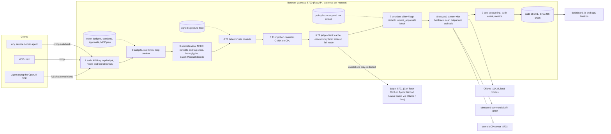

# Bouncer architecture

Bouncer is a gateway that sits between AI agents and everything they call: models (OpenAI-compatible API), MCP tool servers, and other services that ask it for a decision (`POST /v1/guard/check`). Every call passes one decision pipeline driven by one policy file.

## Components

## Request flow (OpenAI proxy)

1. **Authenticate.** `Authorization: Bearer <key>` maps to a principal (agent) with a team, a data clearance, allowed models and allowed tools. Unknown key: HTTP 401. Model outside the allowlist: 403.
2. **Budgets and loops.** Team USD per day, session USD, tokens per minute, local GPU seconds per hour, session step limit, input size. A spent paid budget downgrades the request to the local model (`budgets.on_exceed.downgrade_to`); a spent hard limit returns 429. An open loop breaker (after identical tool calls) returns 429 until the cooldown ends.
3. **Segmentation.** The request is split into segments: system prompt, user messages, tool results (with the tool name resolved from `tool_call_id`), tool definitions. Tool results from `untrusted_source_tools` are untrusted; results from `sensitive_source_tools` mark the session as holding sensitive data.
4. **Normalization.** Invisible characters and Unicode tag characters are removed from what is forwarded; a normalized view (NFKC, homoglyphs folded, leetspeak folded, spaced letters joined) and decoded views (base64, hex, URL encoding) are scanned by every control.
5. **T0 deterministic controls** (always on, target p95 under 2 ms): secrets, PII with checksum validation, injection heuristics (EN, PL, DE, chat-template tokens), signatures from the signed feed, supply chain rules. Results are cached per (policy version, segment hash), so a long conversation is not rescanned on every turn.
6. **T1 classifier** on new untrusted segments: `protectai/deberta-v3-base-prompt-injection-v2` (ONNX, CPU). Score above `block_above` blocks; between `escalate_above` and `block_above` escalates to T2. The model is English-only, so non-English text is escalated to T2 instead of being trusted or blocked on a meaningless score.
7. **T2 judge** only on escalations: grey-zone T1 scores, non-English text, and every side-effect tool call (goal alignment and exfiltration questions). The judge returns probabilities for options defined in the policy (`judge.questions`); thresholds in the policy map them to block or require_approval. The judge sees only redacted content and runs on our own hardware (`judge.allow_external: false` is enforced by the schema).
8. **Decision.** The strongest action wins: allow < log < redact < require_approval < block. `mode: monitor` (global or per control) records what would have happened and enforces nothing. The `permissive` profile records non-critical findings as log; `strict` tightens thresholds and requires approval for every side effect.
9. **Forward and check the response.** Redactions are applied before the upstream sees the request; a canary token is added to the system prompt. The model's text is scanned (secrets, PII, markdown image/link exfiltration, HTML, canary leak). The model's tool calls are checked before the agent receives them: tool allowlist, argument rules (recipient domains, forbidden fields such as BCC, amount limits), signatures and secrets in arguments, lethal trifecta (session read untrusted content and sensitive data and now sends data out), identical-call loops, and the T2 goal-alignment check. Streaming responses are released only up to a safe boundary (64 characters behind the newest token, never inside a token, a markdown link or a PEM block), so redaction works across chunk boundaries; tool calls are buffered until their arguments are complete.
10. **Account and audit.** Cost from token usage and the policy's prices (local models: GPU seconds times an internal rate), one audit event per decision with the full trace, Prometheus metrics.

## Human approval

`require_approval` creates a request (dashboard, `GET/POST /api/approvals`). The agent receives HTTP 403 with `approval_id`. After approval, exactly the same call (SHA-256 of tool name and canonical arguments) is allowed for `approvals.ttl_seconds`; any change to the arguments needs a new approval.

## Policy as code

One YAML file, validated by a pydantic schema that rejects unknown keys. The watcher reloads it within about a second of a save; an invalid file is rejected with a line number and the previous version stays active. Every version is kept in memory with a unified diff and written to the audit log (`policy.reloaded`, `policy.reload_failed`). A control removed from the file is disabled, and the dashboard shows it as disabled.

## Signature feed

`signatures/feed.json` is signed with ed25519 (`feed.json.sig`, public key `signatures/feed.pub`, pinned in the policy). The gateway re-checks the feed every few seconds; a feed with a missing or invalid signature is rejected and the previous version stays active. Each signature carries its source references.

## Audit

`data/audit.jsonl`: one JSON line per decision, with `seq`, `prev_hash` and `hash = sha256(prev_hash + canonical event)`. Only redacted excerpts and masked evidence are stored. `make verify-audit` reports the first modified, deleted or reordered line. Exports: `GET /api/export/audit.jsonl` and `.csv` with the dashboard filters.

## Scaling

- The gateway keeps no per-request state; replicas can run behind a load balancer. Shared counters (budgets, sessions, approvals, MCP pins) live behind the `Store` interface, in memory for one node; with several replicas they move to Redis (atomic increments, sorted sets for time windows).
- The judge is a separate service with the same `POST /v1/decide` interface on a Mac (MLX) or a GPU pool (the same model served with vLLM in production).
- The policy can be loaded from a file, a Git checkout or a URL; the version hash identifies it in every audit event.
- Audit events can be shipped to a SIEM from the JSONL file or stdout.
